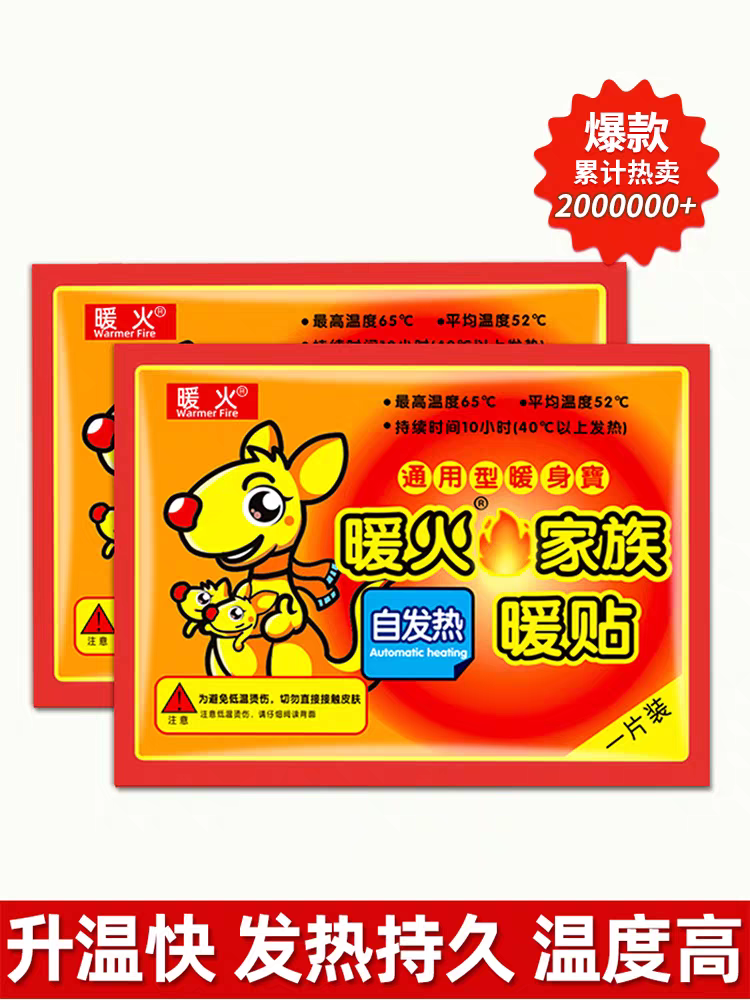
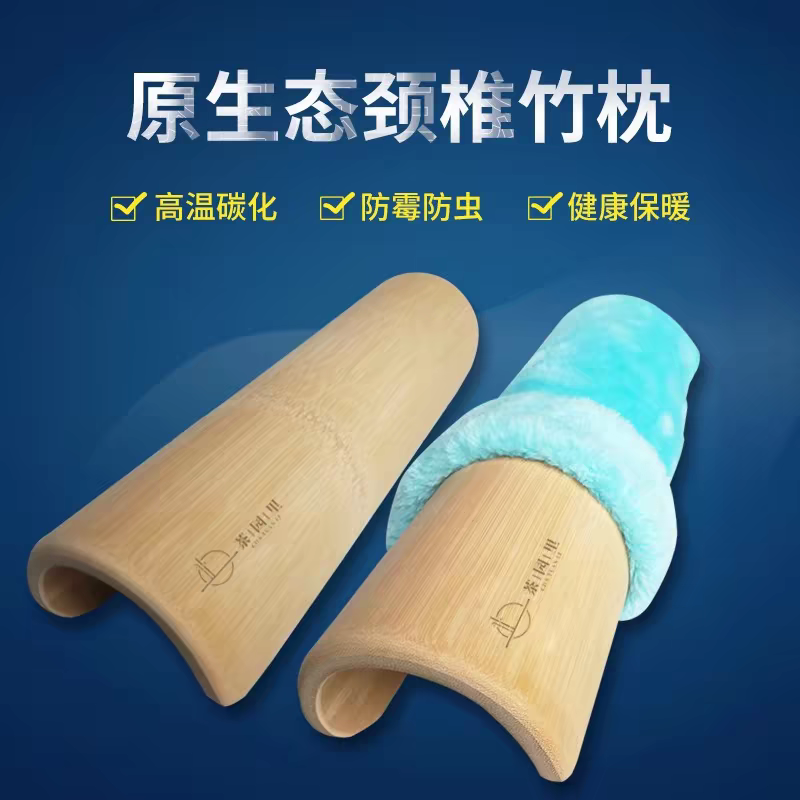

# 腰椎间盘突出有什么好的锻炼方法？

> *十三年腰突患者亲历：从疼到无法正常生活，到基本恢复，我的低成本锻炼与恢复方案*

---

## 我的经历

我从 2013 年确诊腰椎间盘突出，十三年来时好时坏，试过不少方法，始终没有根本改善。直到去年冬天，一次偶然的尝试，让我找到了转机——**热敷 + 腰枕自重锻炼**。

当时给孩子买暖宝宝，我突发奇想贴在腰上，结果一夜之后疼痛明显减轻。后来我白天用热水袋热敷，晚上贴暖宝宝，同时睡觉时在腰下垫一根腰枕。几个月下来，状态越来越好，现在已经基本感觉不到那种折磨人的痛了。

下面我会把整个恢复过程中最核心的 **锻炼思路** 分享出来，希望能帮助同样被腰突困扰的朋友。

---

## 我的三样核心工具

### 1. 热水袋（日用热敷）☀️
白天灌热水，别在裤腰带上，持续温热敷腰部，促进血液循环。

  

> *上图仅为网图示意，热水袋为普通市售产品，请自行选购。*

### 2. 暖宝宝（夜用热敷）🌙
晚上贴一片在疼痛位置，整夜温热，帮助消水肿、活气血。

  

> *上图仅为网图示意，暖宝宝为普通市售产品，请自行选购。*

### 3. 腰枕（睡觉时锻炼+矫形）🛏️
垫在腰下，利用身体自重温和锻炼腰部深层肌肉，同时调节脊柱位置。

  

> *上图仅为网图示意，腰枕为普通市售产品，请自行选购。*

---

## 腰椎间盘突出锻炼的关键思路

很多人以为腰突就要躺着不动，其实**适当、温和的锻炼反而对恢复至关重要**。我的方法分两个阶段，安全第一。

### 第一阶段：被动锻炼——腰枕自重训练（最安全，零门槛）

当你还在疼痛期，或者不敢做任何动作时，**睡觉垫腰枕就是一种非常有效的被动锻炼**。

**原理：**  
平躺时，身体自身重量会自然形成一个向下的力。腰枕在腰部下方制造一个轻柔的支撑点，为了维持身体稳定，腰部深处的多裂肌、回旋肌等小肌群会被不自觉地激活。这是一种“静态募集”训练，**不需任何主动动作，就能温和锻炼到深层稳定肌群**。

同时，脊柱是一整根关联结构，通过调节腰枕的上下位置（从尾椎到胸椎），可以找到让病灶压力最小的角度，起到机械性减压和矫形的作用。

**具体做法：**
- 平躺，膝盖下方可垫枕头让腰部更放松。
- 腰枕放在腰部下方，高度以感觉有轻柔支撑、不悬空、也不硌得慌为准。
- 可以从 5 分钟开始，逐渐适应后整晚使用。
- 如果某个位置躺下后疼痛加重，说明高度或位置不对，立即调整。

这个锻炼方法的好处是：**零体力消耗、零动作风险**，在完全休息中就能悄悄加强腰部的支撑能力。

### 第二阶段：主动锻炼——疼痛缓解后的核心强化

当你通过热敷和腰枕让疼痛明显减轻后，可以尝试加入一些**医生推荐的、低冲击的核心肌群锻炼**，进一步给脊柱穿上“肌肉铠甲”。

- **臀桥**：仰卧屈膝，臀部抬起，锻炼臀大肌和下背。
- **鸟狗式**：跪姿交替伸展对侧手脚，提升核心稳定性。
- **死虫式**：仰卧交替放低对侧手脚，学会在动作中保持腰椎稳定。

**务必遵守的原则：**
- **无痛原则**：任何动作如果引发疼痛、麻木，立刻停止。
- **从低强度开始**：次数从 5-6 次起步，不贪多。
- **动作质量＞数量**：慢、控制、呼吸配合，不靠爆发力。
- **先咨询医生**：每个人突出的位置、程度不同，最好在康复科医生指导下进行。

---

## 我的腰突恢复六法（系统整合）

这些方法需要一起使用，而不是只靠某一种。锻炼是其中的一环，但离不开其他五项的配合。

| 序号 | 方法 | 说明 |
|:---:|:---:|:---|
| 1 | 🧠 **正念** | 正视自己的身体问题，不再逞强，接纳现状并积极行动。 |
| 2 | 🛌 **躺休** | 急性期充分卧床休息，让受压的神经根得到缓解。 |
| 3 | 🔥 **热敷** | 每天坚持热敷，消除神经根水肿，改善局部气血循环。 |
| 4 | 🦴 **矫正** | 用腰枕在躺卧时温和调节脊柱，减轻椎间盘压力。 |
| 5 | 💪 **力炼** | 第一阶段腰枕自重锻炼，第二阶段安全的核心动作，逐步提升腰部力量。 |
| 6 | 🌱 **生长** | 相信人体的自愈力，创造好条件（休息、营养、心态），身体会慢慢修复。 |

**正念第一，六法齐用，尤其是热敷与腰枕锻炼的配合，是我从十三年困境中走出来的根本原因。**

---

## ⚠️ 温馨提醒

- 🔥 **谨防低温烫伤**：暖宝宝**严禁直接贴在皮肤上**，必须隔一层内衣。睡觉时使用更要留意，感觉过热或发痒，立即移除。
- 💧 **热水袋安全**：不要灌沸水，装七分满排出空气，拧紧盖子，最好用毛巾包裹后接触身体。
- 🚫 **不适宜人群**：皮肤感觉迟钝者（如糖尿病患）、急性炎症期、皮肤破损处不要热敷。如果出现下肢麻木无力、大小便障碍，需立即就医。
- 📏 **腰枕高度**：因人而异，以舒适为原则，睡醒后更痛说明不合适，需要调整。
- 🛒 **工具选购**：文中所有配图均为网图示意，热水袋、暖宝宝、腰枕均为普通市售产品，请自行购买正规合格商品。
- ⚕️ **重要声明**：以上全部内容为**个人经验分享，不构成医疗建议**。每个人的病情不同，请在尝试任何方法前咨询专业医生。

---

## 最后

一只热水袋，一片暖宝宝，一根腰枕，再加上正确的锻炼思路——  
让我从长达十三年的腰椎间盘突出折磨中解脱出来。

如果能给同样在痛苦中寻找出路的你一点启发，就是我写下这些字的最大意义。

### ☕ 如果这篇文章对你有帮助，欢迎请我喝杯热茶

| 微信打赏 | 支付宝打赏 |
| :---: | :---: |
|  |  |

---

> 📌 本文首发于 GitHub Pages，原创不易，转载烦请注明出处  
> 🔍 关键词：腰椎间盘突出 锻炼方法 腰枕 热敷 自重训练 腰突恢复

